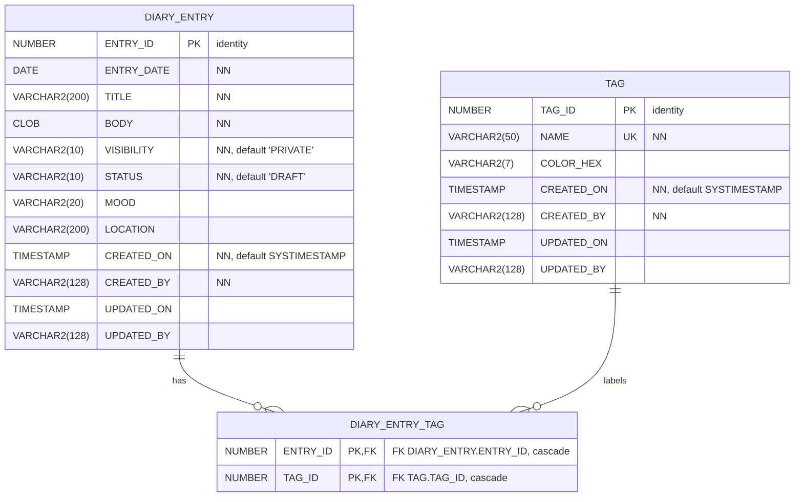

# Simple Diary — Oracle & APEX Starter Model

This repository contains a tiny, **test‑friendly** Oracle schema you can use for GP3 tutorials, unit tests, and quick APEX demos.  
It is intentionally small (2–3 tables) but demonstrates **identity PKs, CLOB handling, audit columns, a many‑to‑many junction**, and a helper **view with `LISTAGG`** for nicer UI display.

> Use this when you need a clean, repeatable dataset to build and test APEX features (Calendar, Forms, Faceted Search, Tag filters, etc.).

---

## Highlights

- **Tables:** `DIARY_ENTRY`, `TAG`, `DIARY_ENTRY_TAG` (m:n junction with `ON DELETE CASCADE`)
- **Audit fields + triggers:** `*_BIUR` set `CREATED_*` and `UPDATED_*`
- **Indexes:** on entry date and `UPPER(title)`
- **View:** `DIARY_ENTRY_TAGS_V` exposes `TAGS_CSV` via `LISTAGG` for easy reporting/cards
- **Seed data:** a first entry and a few tags so the app feels alive
- **APEX‑ready:** clean PKs, CLOB for `BODY`, natural Calendar key (`ENTRY_DATE`)

---

## ER Diagram



---

## Objects included

- **Tables**
  - `DIARY_ENTRY (ENTRY_ID, ENTRY_DATE, TITLE, BODY, VISIBILITY, STATUS, MOOD, LOCATION, CREATED_*, UPDATED_*)`
  - `TAG (TAG_ID, NAME, COLOR_HEX, CREATED_*, UPDATED_*)`
  - `DIARY_ENTRY_TAG (ENTRY_ID, TAG_ID)` with `PK(ENTRY_ID, TAG_ID)` and `ON DELETE CASCADE`
- **Triggers**
  - `DIARY_ENTRY_BIUR` and `TAG_BIUR` (set `CREATED_*` on insert; `UPDATED_*` on update)
- **Indexes**
  - `DIARY_ENTRY_NK1` on `(ENTRY_DATE)`; `DIARY_ENTRY_NK2` on `(UPPER(TITLE))`
- **View**
  - `DIARY_ENTRY_TAGS_V` → adds `TAGS_CSV` via `LISTAGG`

---

## How to deploy (SQLcl/SQL*Plus)

1. Connect to your target schema.
2. Run the starter script (adjust path/name if needed):
   ```sql
   @db/diary_model.sql
   ```
3. Verify objects:
   ```sql
   SELECT table_name FROM user_tables WHERE table_name IN ('DIARY_ENTRY','TAG','DIARY_ENTRY_TAG');
   SELECT view_name  FROM user_views  WHERE view_name  = 'DIARY_ENTRY_TAGS_V';
   SELECT trigger_name FROM user_triggers WHERE table_name IN ('DIARY_ENTRY','TAG');
   SELECT * FROM DIARY_ENTRY_TAGS_V;
   ```

> Re‑running is safe if your script includes the `DROP ... EXCEPTION WHEN OTHERS THEN NULL` preamble (as shown in the example you pasted).

---

## APEX quickstart (suggested pages)

1. **Dashboard – Calendar**
   - **Source:** `DIARY_ENTRY`
   - Start Date: `ENTRY_DATE`
   - Title: `TITLE`
   - Link target: Entry form (pass `ENTRY_ID`)

2. **Entries – List + Form**
   - **Report:** Interactive Report on `DIARY_ENTRY_TAGS_V` (so you can display `TAGS_CSV`)
   - **Form:** CRUD on `DIARY_ENTRY` with items:
     - `TITLE`, `ENTRY_DATE` (default `SYSDATE`), `BODY` (Text Area for CLOB), `VISIBILITY`, `STATUS`, `MOOD`, `LOCATION`
     - **Tags selector:** Checkbox Group or Shuttle based on `TAG` (`return = TAG_ID`, `display = NAME`)

   - **Process to persist tags (simple delete+insert):**
     - Create an item `PXX_TAG_IDS` that holds the selected Tag IDs (colon‑delimited when using checkbox/shuttle).
     - Add an *After Submit* PL/SQL block (on Create/Save):
       ```plsql
       -- assume :PXX_ENTRY_ID is your primary key item
       -- and :PXX_TAG_IDS is the checkbox/shuttle return value (e.g. '1:3:7')
       DELETE FROM diary_entry_tag WHERE entry_id = :PXX_ENTRY_ID;

       INSERT INTO diary_entry_tag (entry_id, tag_id)
       SELECT :PXX_ENTRY_ID, TO_NUMBER(column_value)
         FROM TABLE(apex_string.split(:PXX_TAG_IDS, ':'));
       ```
     - (If you prefer zero‑code, APEX also has a **Link Table** process type for many‑to‑many.)

3. **Tags – Admin**
   - Interactive Grid on `TAG` for simple maintenance.

4. **Optional: Public View**
   - Report on `DIARY_ENTRY_TAGS_V` with `WHERE visibility = 'PUBLIC'`.

---

## Seed data

The starter script inserts a first entry and three tags (`Work`, `Travel`, `Ideas`).  
It also links the first entry to two tags so filters/chips appear immediately in APEX.

---

## Test‑friendliness (for GP3)

- **Identity PKs** → no sequence maintenance in tests.
- **Junction `ON DELETE CASCADE`** → teardown is straightforward.
- **Single script** you can call from GP3 seeds (idempotent if using the drop‑safe pattern).
- **View** keeps page SQL simple; great for Cards/IR/Reports.

---

## Next steps / ideas

- Add simple **search facets** (Status, Visibility, Tag).
- Swap `BODY` to **Rich Text** (APEX item) if you want formatting.
- Add **attachments** (separate table) if you want to demo BLOB handling later.

---

## License

MIT (or choose your preferred license).
